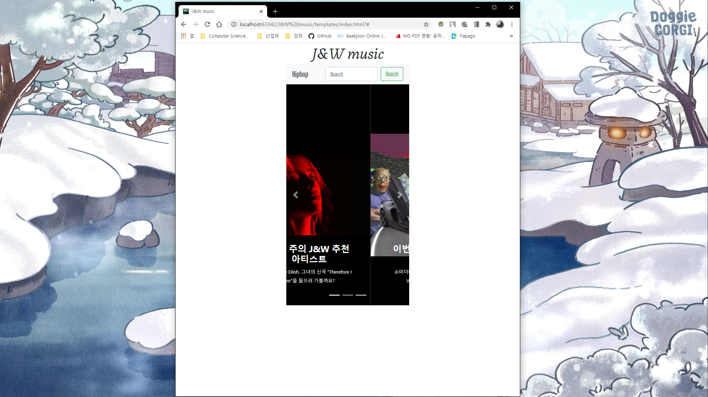

# J&W music
*Music website project*

장르를 막론하고 어떤 계기가 되었든 한 가수나 음악에 꽂히게 되면 자연스럽게 그 가수의 다른 음악이나 더 나아가 같은 장르의 다른 훌륭한 아티스트의 음악을 찾아듣고 싶기 마련이다.

요즘은 음원 스트리밍 사이트에서 추천 아티스트나 자체 플레이리스트로 그런 갈증을 어느 정도 해결해주기는 하지만 정보가 부족하기도 하고 실제 리스너들의 니즈를 충족시키지 못하는 경우가 대부분이다.

따라서 우리는 유저들이 원하는 장르에 어떤 유명한 아티스트가 활동하는지, 숨은 보석같은 아티스트는 또 누가 있는지, 그리고 그 아티스트의 모든 정보들까지 한 군데서 간편하게 확인하고 또 
그들의 컨텐츠를 즐길 수 있는 웹서비스를 만들고자 하였고 이 프로젝트를 진행하게 되었다.

다음 내용은 J&W music 서비스를 개발하면서 직면했던 어려움과 그것들을 어떻게 해결하였는지 기록한 것이다.

---

---

> **Day 1**

일단 HTML + CSS 부터 구현하기 시작하였다. 사이트 접속 시 첫 화면을 사이트 제목과 navigation bar, 그리고 금주의 핫 아티스트와 떠오르는 아티스트, 추천 아티스트를 carousel slide 형식으로
구현하고 그 밑에는 카드형식으로 여러 아티스트를 보여주기로 구상하고 제작했다. 

일단 사이트 제목과 navigation bar, 그리고 carousel slide를 구현했는데 이 과정에서 직면한 문제점은 2가지였다.

***1. 페이지 크기를 줄였을 때 웹 사이트가 찌그러지는 현상***

